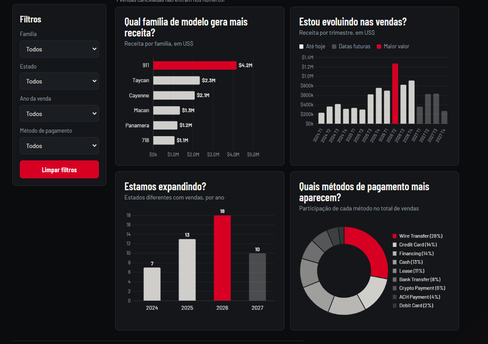
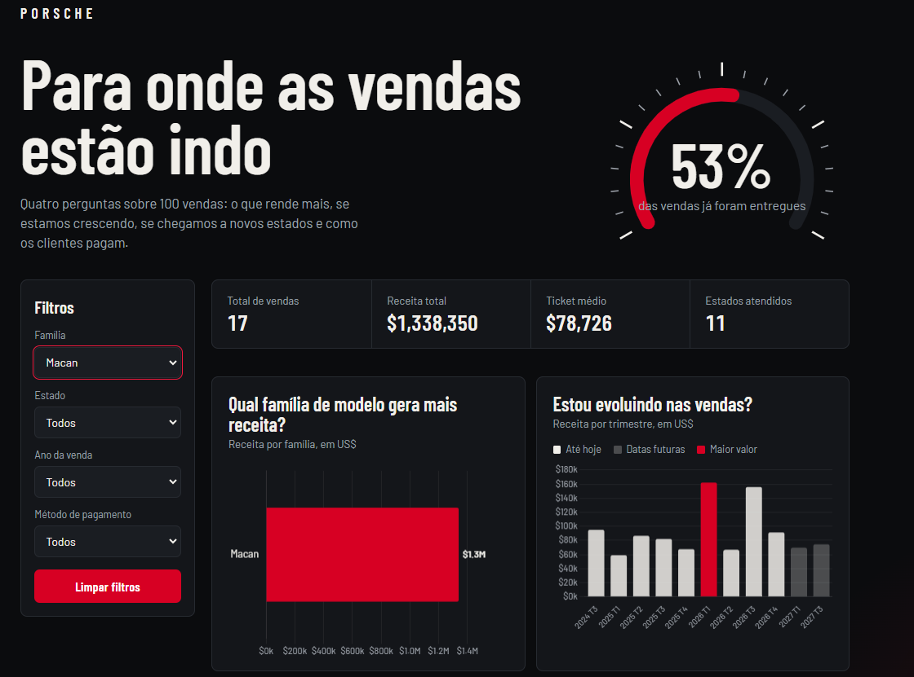

# Dashboard de vendas Porsche

Painel em HTML (arquivo único) que responde perguntas de negócio sobre 100 vendas de Porsche, com filtros e indicadores.

**Dashboard publicado:** https://helodums.github.io/dashboard-porsche/

## Prints





Exemplo de filtro: ao escolher a família **Macan**, o painel mostra 17 vendas, US$ 1.338.350 de receita, ticket médio de US$ 78.726 e 11 estados. Conferi esses números direto na planilha e batem.

## Perguntas de negócio

1. **Qual família de modelo gera mais receita?** Mostra onde está o dinheiro. A família 911 lidera, com US$ 4,2 mi.
2. **Estou evoluindo nas vendas?** Receita por trimestre. O melhor trimestre foi 2026 T2.
3. **Estamos expandindo?** Quantidade de estados diferentes com vendas por ano: 7 (2024), 13 (2025), 18 (2026).
4. **Quais métodos de pagamento mais aparecem?** Mostra como os clientes pagam. Wire Transfer é o mais usado, com 28%.

Escolhi essas perguntas porque juntas contam uma história: onde ganhamos dinheiro, se estamos crescendo, se estamos chegando a novos lugares e como o cliente paga.

## Filtros e indicadores

- Filtros: família, estado, ano da venda e método de pagamento (combinam entre si).
- Indicadores: total de vendas, receita total, ticket médio e estados atendidos.
- Medidor: porcentagem de vendas já entregues (status Delivered).

## Tratamento da base

- Usei só as colunas sanitizadas (modelo, data, preço, pagamento, estado e status de entrega).
- Deixei de fora `customer_name` e `salesperson`, porque a base fica dentro do HTML público e são nomes de pessoas.
- Os 40 modelos viraram 6 **famílias** (911, 718, Cayenne, Macan, Panamera, Taycan), para o gráfico não ficar poluído.
- Troquei o filtro de cidade por **estado**: eram 79 cidades em 100 vendas, quase uma por venda.
- 24 datas estavam `INVALID`. Essas vendas entram nos indicadores e nos gráficos de família e pagamento, mas ficam fora dos gráficos por trimestre e por ano. No filtro de ano existe a opção "Sem data".
- 22 vendas têm data futura (de out/2026 até out/2027). Não apaguei: elas aparecem em tom apagado e com legenda "Datas futuras".
- As 7 vendas canceladas (`Cancelled`) ficam fora de todos os números.
- Os valores estão em dólar (US$).

## Ferramenta usada

Usei o **Claude** (conversa com IA) para montar o dashboard em HTML com Chart.js. Não usei ChatGPT Canvas nem agente com skill. O arquivo foi publicado no GitHub Pages.

## Prompt e o que mudou até a versão final

Prompt base (versão 3):

```
Crie uma dashboard de vendas da Porsche em UM ÚNICO arquivo HTML
(HTML + CSS + JavaScript, sem build, sem backend). Use Chart.js via CDN.
Dados embutidos no HTML. Colunas: modelo, data, preço (US$), pagamento,
estado e status de entrega. Crie o campo Família a partir do modelo.
Vendas Cancelled ficam fora dos números. Datas INVALID ficam fora dos
gráficos de tempo.
Perguntas: (1) família que gera mais receita, (2) evolução da receita por
trimestre, (3) estados distintos com vendas por ano, (4) participação dos
métodos de pagamento.
Indicadores: total de vendas, receita total, ticket médio, estados atendidos.
Filtros: família, estado, ano da venda, método de pagamento, com botão
Limpar filtros.
Visual escuro com vermelho Porsche. Responsivo. Código comentado.
```

O que mudou até a versão final:

- **v1:** tinha perguntas de modelo, preço por ano e pagamento por estado, e a moeda estava errada (R$).
- **v2:** corrigi para US$, agrupei modelos em famílias e troquei cidade por estado.
- **v3:** troquei a pergunta de preço por ano por duas perguntas mais úteis: "Estou evoluindo?" e "Estamos expandindo?".
- **Visual:** testei um estilo claro e uma versão com carro animado, e descartei as duas. A versão final é escura, com filtros na lateral e um medidor de entregas.
- **Ajuste final:** os números de receita e ticket médio saíam do card, então fiz o tamanho da fonte se adaptar à largura do card.

## Arquivos

- `index.html`: o dashboard.
- `print-geral-1.png`, `print-geral-2.png`, `print-filtro-macan.png`: evidências de que o painel funciona.
